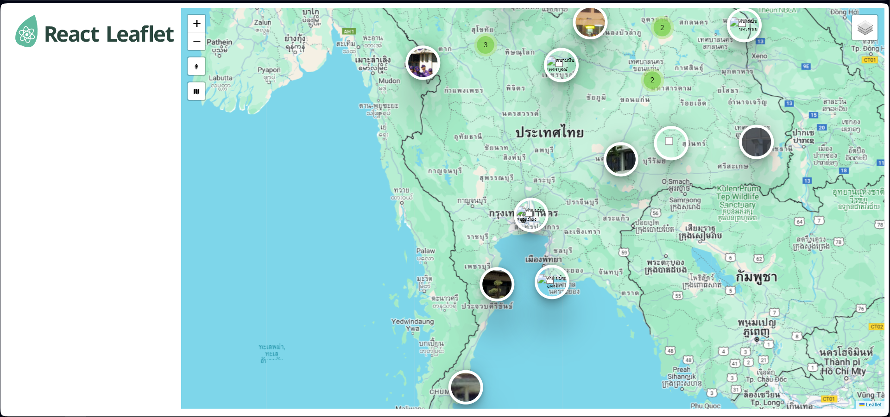

# react-leaflet-map

Small projects using `React` & `Leaflet` Packages Working on docker

Demo : https://react-leaflet-map-seven.vercel.app

---

### `git clone`

Clone project

### `docker compose up`

After clone project into your docker go to folder_project and type `docker compose up` to run project , Will be automatic start with `npm run start`

## Knowledge

[GIS Solutions - Leaflet Tutorial](https://www.youtube.com/watch?v=xHmS4OpcEOc&list=PLnHeemIZ2QILzh2FL0Nvo5X0RFOmF3Xor&index=5).

[รอยไถ พัฒนา - React Leaflet](https://www.youtube.com/watch?v=gzYGOcWA4f0&list=PL3CRqF9WxjEa_R0p2uhZzto21h6B8Ofu1&index=1).
